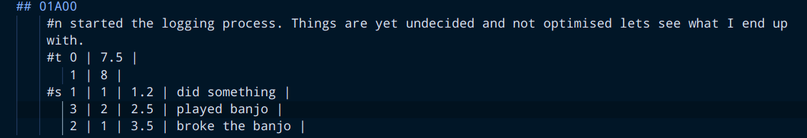
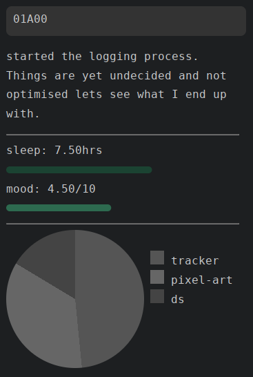
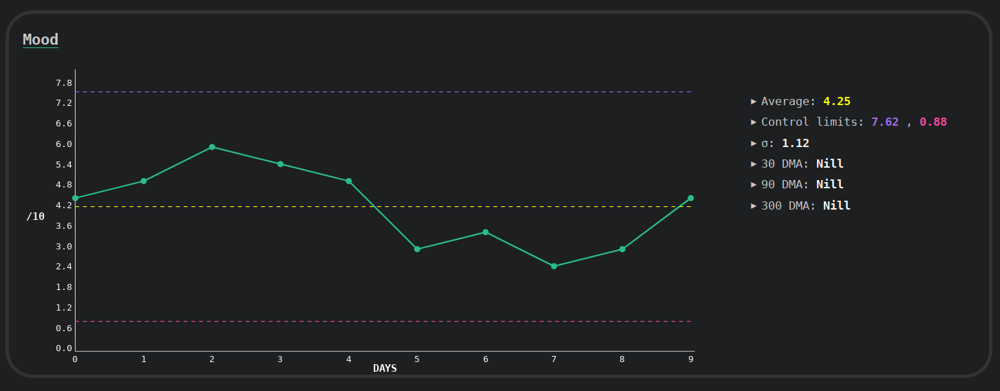

# MeLoE (Memex & logs engine)

A memex and logs based journaling system meant to keep track of my life. Still in early development.

Meloe uses a simple static website generator written in C++ that takes markdown format as input.

Inspired from [hundredrabbits/100r.co](https://github.com/hundredrabbits/100r.co)

Created for my website [kosmoknot](https://kosmoknot.netlify.app/)

## What all it keeps track of?

Meloe keeps track of logs, stats and sectors for each date.

### Date 

Date format used is inspired from [french revolutionary calender format](https://www.cooksinfo.com/french-revolutionary-calendar). Each year has 26 months (A-Z) of 2 weeks (7 days) each. Leap year has 15 days in Z month. This is written in DDMYY format and day 0 is the day I start logging.

### Logs (#n)

Logs are notes about that day. Could be used as a diary or a journal.

Logs are noted in the ledger.md file.

### Stats (#t)

Stats are daily observations about something. It could be sleeping hours, mood, or number of butterflies spotted.

The numerical value of sector is noted in the ledger.md file.

### Sectors (#s)

Sectors could be any activities you do in your day but currently I am using it to track my projects. Each sector has a task in it which for a project could be planning, execution, and documentation. Sectors also have their own wiki pages where you can keep further details.

Sectors could also be used to keep track of learning a new skill, hobbies or day job.

Amount of time / effort for a given sector and task is noted in the ledger.md files along with a note.

### Stray Cats

Anything else you want. Need not to make a meow sound.

There can be any number of stray cats. Stray cats are stored in <stray-cat-name>.md file in stray cat folder.

## How the tracked data is visualised?

### Ledger entries

Keeps track of daily logs, also contains pie chart of various sectors for that day along a bar graph of with stat values

### Stats charts

Stat charts are line chart showing data for last 90 days with control lines (3 sigma). Summary along with charts shows relavent statistical insights for tracked data.

### Sectors

Sectors are used to generate wiki article entries.

### Stray Cats

A HTML page is generated for each stray cat and a Home.html is generated with index of all stray cats

## How meloe works under the hood?

### Template manager

### Tips for users

* Priviledged i.e. I have embedded these in code so don't remove them keywords->
* * Previledged css class names : 
* * Priviledged template names : {{wiki-entries}},{{ledger-header}},{{ledger-entry}},{{ledger-footer}},{{home-header}},{{home-footer}},{{home-entry}}

* While using templates, avoid spaces in {{declaration_here}}.

## TODO

* [ ] Render sector insight in project pages

## Credits:

Template Manager: [AbstractXan/Mizi](https://github.com/AbstractXan/Mizi)

## FAQs

Q1. Why is there a test section with no test cases?
-> Me lazy.
