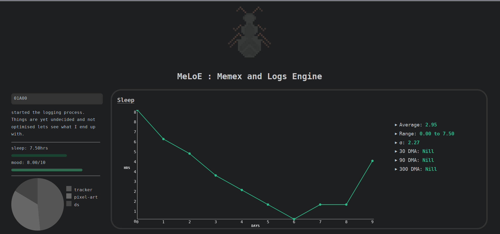

# MeLoE (Memex & logs engine)

A memex and logs based journaling system meant to keep track of my life. Still in early development.

Meloe uses a simple static website generator written in C++ that takes markdown format as input.

Inspired from [hundredrabbits/100r.co](https://github.com/hundredrabbits/100r.co)

Created for my website [kosmoknot](https://kosmoknot.netlify.app/)

## What all it keeps track of?

Meloe keeps track of logs, stats and sectors.
### Logs
Logs are notes about that day. Could be used as a diary or a journal.

Logs are noted in the ledger.md file.

### Stats

Stats are daily observations about something. It could be sleeping hours, mood, or number of butterflies spotted.

The numerical value of sector is noted in the ledger.md file.

### Sectors

Sectors could be any activities you do in your day but currently I am using it to track my projects. Each sector has a task in it which for a project could be planning, execution, and documentation. Sectors also have their own wiki pages where you can keep further details.

Sectors could also be used to keep track of learning a new skill, hobbies or day job. 

Amount of time / effort for a given sector and task is noted in the ledger.md files along with a note.

### Stray Cats

Anything else you want. Need not to make a meow sound.

There can be any number of stray cats. Stray cats are stored in <stray-cat-name>.md file in stray cat folder.

## How it keeps track of it all?

### Ledger entries

### Stats

### Sectors

### Stray Cats

## TODO

[] Render sector notes in project pages
[] Render sector insight in project pages
[] Render stray cats

## Credits:
Template Manager: [AbstractXan/Mizi](https://github.com/AbstractXan/Mizi)